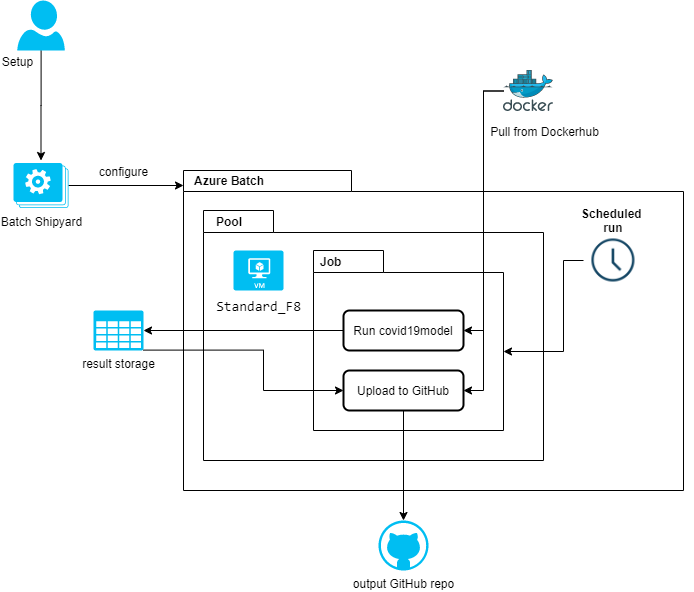

# covid19model-shipyard
Shipyard configuration for running the covid19model on Azure batch / HPC

## Architecture




## Setup

### Create an Azure batch account
First an Azure batch account needs to be set-up. For this please follow the documentation from Microsoft, and make sure that you create a storage account during the setup.
[Create a batch account with Azure portal](https://docs.microsoft.com/en-us/azure/batch/batch-account-create-portal)

### credentials.yaml file
Set the names and keys in the [credentials.yaml](credentials.yaml).

### Shipyard setup
You can either use [Batch Shipyard](https://batch-shipyard.readthedocs.io/en/latest/) locally or in the Azure cloud shell. 

[Batch Shipyard Installation Guide](https://batch-shipyard.readthedocs.io/en/latest/01-batch-shipyard-installation/)

Azure Cloud shell is the only method which was already tested for this setup.

Make sure to set the `SHIPYARD_CONFIGDIR` environment variable to the directory containing the YAML-files and this readme. 

### Create the pool 

The pool of machines will be setup using shipyard. 

```
shipyard pool add
```

When this command has finished you will also have created an SSH key in the files `id_rsa_shipyard` and `id_rsa_shipyard.pub`. Please safely guard and store those keys. 

### Create the job
Once the pool setup is finished the job can be created using the following Shipyard Batch command:

```
shipyard jobs add --recreate
```

The same command can also be used if you want to perform any updates to the job. 